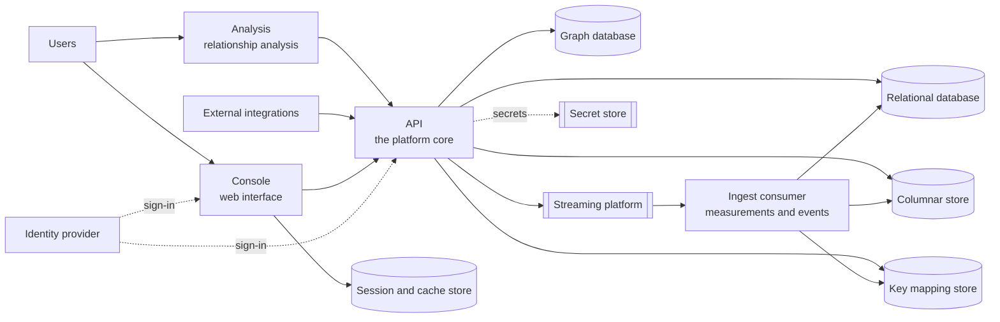

# Architecture, without the jargon

<Personas>
  <Persona primary>Administrators</Persona>
  <Persona>IT and OT operations</Persona>
  <Persona>Engineers</Persona>
</Personas>

<KeyIdea>
DataHub is **three core services**, plus an analysis service behind the Analyze tab and a
scheduled housekeeping service, on a set of standard backing stores.

Each service has a different job and a different scaling profile, which is exactly why they
are separate: you can scale data ingestion without adding capacity for users, and restart
the web interface without interrupting ingestion.
</KeyIdea>

## The whole picture

## The services

### API, the core

The REST interface. Everything that reads or writes data goes through it, whether from the
console, from an integration, or from a script. It owns the model and the ingestion
endpoints, and it is where access decisions are made.

It also keeps the **knowledge graph** in step with the model. Every model change is
recorded first, then copied to the graph moments later and retried until it succeeds, so a
restart or a graph database outage delays the copy rather than losing a change. Any API
instance can do this work, so nothing needs to run single-instance for the graph. The copy
lags by milliseconds, so a read straight after a write can briefly predate it.

**Scales with:** user and integration traffic.
**Stateless:** yes, entirely, including its live-streaming connections.

### Console, the web interface

What people use. It is a server-rendered web application and an OAuth2 client against your
identity provider, holding sign-in tokens server-side rather than in the browser.

**Scales with:** number of concurrent users.
**Stateless:** yes, provided the shared session store is reachable.

### Ingest consumer, measurements and events

Reads incoming measurements and events off the streaming platform, writes them into the
columnar store in efficient batches, keeps the event key mappings current, and fans live
data out to [whoever is subscribed](/using/subscriptions).

**Scales with:** ingest volume. Add instances and the streaming platform distributes the work
between them automatically.

### Analysis, relationship analysis

A separate stateless compute service with no database of its own. The console's Analyze tab
calls it **directly from the browser**; it validates the user's token and fetches data from
the API on their behalf, so data set permissions still apply.

**Scales with:** analysis queries. **Stateless:** yes, entirely.

The service also offers the analysis to [AI agents](/using/mcp#the-second-server-statistics-as-a-tool)
with the same sign-in checks, and no extra configuration is needed to expose it. The console's assistant reaches it through the same address setting the
Analyze tab uses, and copes with its absence: in a deployment that leaves the service out,
the assistant keeps working and that one tool is simply unavailable.

### Housekeeping

A scheduled, single-instance service that runs the routine sweeps described in
[data lifecycle](/administration/data-lifecycle): purging soft-deleted files after their
grace period, clearing stale temporary uploads, and sweeping orphaned
[streaming](/using/subscriptions)
subscriptions. Also not yet in the reference deployment.

## Why several services rather than one

Three concrete benefits, all of them operational:

- **Independent scaling.** Ingest volume and user traffic are unrelated. Splitting them
  means adding ingest capacity does not mean adding API capacity.
- **Independent failure.** Restarting the web interface does not interrupt ingestion.
- **Permissions stay in one place.** Even the analysis service holds no data: it fetches
  through the API with the caller's own token, so there is no second access-control system
  to keep aligned.
- **No web server where one is not needed.** The ingest consumer has no HTTP interface at
  all, which reduces both resource use and attack surface.

## The backing stores

Each was chosen for a specific job. All are standard, widely deployed systems your
infrastructure team can likely already operate.

| Store | Job | Why this one |
| --- | --- | --- |
| **Relational database** | The model and system of record | Transactional correctness for the things that must be right |
| **Columnar store** | Measurements and events | Measurements are many distinct series, almost always appended and read in large sweeps, exactly the columnar workload |
| **Graph database** | Traversing the model | Multi-hop traversals over typed relationships are natural here and painful in SQL |
| **Streaming platform** | Data in flight | Multi-tenancy at the broker level, and per-consumer distribution models |
| **Key mapping store** | Event key mappings | Fast lookups, kept out of the transactional path |
| **Session and cache store** | Sessions and query cursors | Lets the console scale without session affinity |
| **Secret store** | Credentials and the tenant registry | Secrets belong in a secret store with access control and audit |

:::tip Why both a relational database and a graph database?
The relational database remains the system of record for entities. The graph database serves
relationship traversal. Expressing multi-hop traversals in SQL gets painful quickly; in a
graph query language it is natural. They hold the same model from two angles, and the API keeps
the graph up to date itself, moments after each model change commits.
:::

## Load balancing

All services run as multiple instances behind a load balancer. The requirements are modest:

- **WebSocket upgrade support**, for the [live data connections](/using/subscriptions#the-two-kinds)
- **Long connection timeouts**, because those connections are long-lived
- **No session affinity**, no instance holds unrecoverable
  state

That last point is worth emphasising because it is unusual for a platform with live
streaming. A live connection is one TCP connection, already pinned to the instance that
accepted it. On reconnect, nothing is lost: the subscription position lives on the streaming
platform, and the browser's live tail is a non-durable read from the latest position. A
reconnect can land on any instance and resume.

So the load balancer can simply round-robin everything.

Two settings on it are still worth getting right, and both are in the reverse-proxy examples
that ship with the platform: a **per-IP request limit**, which bounds the traffic arriving
before any caller has been identified, and a **body size ceiling set above** the API's own,
so that an oversized request comes back as the platform's own readable message rather than
the proxy's error page.
[Limits and quotas →](/administration/limits-and-quotas#at-the-reverse-proxy)

## What runs where, at minimum

For a small production installation:

<Steps>
  <Step title="Two API instances">
    For availability. Add more as user and integration traffic grows.
  </Step>
  <Step title="Two console instances">
    For availability. It is a thin layer; it rarely needs more.
  </Step>
  <Step title="Two or more ingest consumers">
    Sized to ingest volume. This is the one you add instances to as data grows.
  </Step>
  <Step title="The backing stores, sized and backed up per your standards">
    These are ordinary systems and your existing operational practices apply.
    [Data lifecycle →](/administration/data-lifecycle)
  </Step>
</Steps>

<References>

- [Apache Pulsar](https://en.wikipedia.org/wiki/Apache_Pulsar)
- [ClickHouse](https://en.wikipedia.org/wiki/ClickHouse)
- [PostgreSQL](https://en.wikipedia.org/wiki/PostgreSQL)
- [Neo4j](https://en.wikipedia.org/wiki/Neo4j)
- [Column-oriented databases](https://en.wikipedia.org/wiki/Column-oriented_DBMS)
- [WebSocket](https://en.wikipedia.org/wiki/WebSocket)
- [Load balancing](https://en.wikipedia.org/wiki/Load_balancing_(computing))

</References>

<Deeper>
- [Installing](/administration/installing): standing this up
- [Limits and quotas](/administration/limits-and-quotas): the per-tenant budgets, and what the proxy in front should enforce
- [Data lifecycle](/administration/data-lifecycle): capacity planning and backups
- [Organisations and tenants](/administration/organizations): how multi-tenancy maps onto these stores
- [Frequently asked questions](/reference/faq): the reasoning behind these architecture choices
</Deeper>
