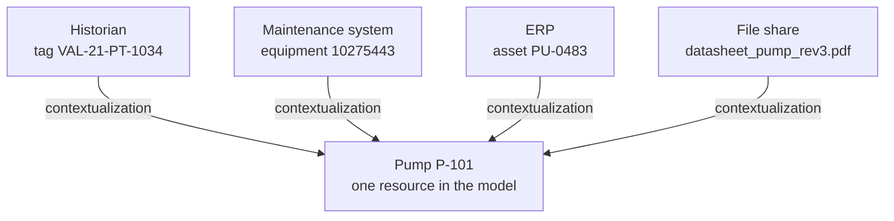

# What is contextualization?

<Personas>
  <Persona primary>Leadership</Persona>
  <Persona primary>Domain experts</Persona>
  <Persona>Engineers</Persona>
</Personas>

<KeyIdea>
Contextualization is the work of attaching each piece of data to the
real-world thing it describes: this signal belongs to that pump, this work order
concerns that vessel, this datasheet documents that transformer.

It sounds mundane, and it is the single activity that turns a pile of records into a model
you can reason over. The [ontology](/concepts/ontology) describes what can exist; the
[knowledge graph](/concepts/knowledge-graph) is the result; contextualization is the doing.
</KeyIdea>

## The problem, in one picture

The same physical pump is known to four systems under four different names, and none of them
records that the four are the same thing:

Everything DataHub does downstream, traversal, investigation, reporting, agents, the
[digital twin](/concepts/digital-twin) itself, assumes those links exist. Contextualization is how they come to exist. It is the bridge between
[data liberation](/start/data-liberation), which makes the records reachable, and the
[knowledge graph](/concepts/knowledge-graph), which makes them navigable.

## How it relates to the other three words

| Word | What it is | Analogy |
| --- | --- | --- |
| [Taxonomy](/concepts/taxonomy) | The classes things can belong to | The library's subject scheme |
| [Ontology](/concepts/ontology) | Classes plus the relationships allowed between them | The cataloguing rules |
| **Contextualization** | The *activity* of linking real records to real things | The librarian cataloguing each book |
| [Knowledge graph](/concepts/knowledge-graph) | The populated result | The finished catalogue |
| [Digital twin](/concepts/digital-twin) | The graph, kept in step with live data | The catalogue, plus live circulation records |

The first two are decided by a few people in a room and revisited rarely. Contextualization
is continuous: every new signal, document and source system arrives uncontextualized, and
the value of the platform tracks how quickly it gets connected.

## What a business actually gets from it

Each of these is impossible while the links live in people's heads, and routine once they
are data:

- **Search that finds things.** Ask for a pump and get its signals, events, documents and
  neighbours, not four separate result lists in four systems.
- **Cross-silo answers.** *"Which assets had maintenance open during the pressure
  excursion?"* is only answerable when work orders and signals point at the same resources.
- **Faster onboarding.** A new engineer navigates the model instead of spending a year
  learning which tag maps to which equipment number. The mapping stops being tribal
  knowledge, which is also what removes the
  [key-person risk](/value/cost-of-doing-nothing#2--knowledge-concentrated-in-people).
- **Documents attached to equipment.** The datasheet is reachable from the pump, rather
  than from whoever remembers the folder. [Files →](/using/files)
- **Usable AI.** An [agent's](/value/ai-agents) accuracy is set by the context available to
  it. Contextualization is, quite literally, the manufacturing of
  that context. And once several agents run as an
  [organisation](/value/ai-agents#coordination), it is what lets all of them mean the same
  thing by "pump P-101".

## How it is done in practice

Mostly by exploiting identifiers your operation already maintains, which is why
[naming discipline](/concepts/naming-and-standards) matters so much.

<Steps>
  <Step title="Match on the identifiers you already have">
    A plant tag such as `VAL-21-PT-1034` already encodes facility, system and instrument.
    When the historian, the maintenance system and the model all carry the tag somewhere,
    [linking them](https://en.wikipedia.org/wiki/Record_linkage) is mechanical. This is the workhorse method, and the reason to mirror your
    tagging standard in the [external id](/concepts/naming-and-standards#external-ids-are-promises).
  </Step>
  <Step title="Use structure where identifiers differ">
    When systems disagree, the tag prefix, the location code or the system number usually
    narrows a record to a handful of candidates, and a person confirms the match once. The
    confirmed link is then permanent.
  </Step>
  <Step title="Let people resolve the remainder">
    Some fraction always needs judgement, a renamed unit, a retagged loop, a document with
    no reference on it. This is domain-expert work in the console, and it is the part worth
    scheduling rather than hoping away.
  </Step>
  <Step title="Contextualize on arrival, from then on">
    Once the model exists, every new source is linked as it lands, so the backlog never
    rebuilds. An integration that writes data without relating it to resources is leaving
    the job half done. [CDC and landing data well →](/using/cdc-integrations)
  </Step>
</Steps>

:::tip An honest sizing note
For a facility with a consistent tagging standard, the bulk of contextualization is
automatable and the manual remainder is small. For an operation whose systems grew without
shared identifiers, the manual share is larger, and **that effort *is* the project**. Assess
which situation you are in before promising a timeline, it is the single best predictor of
integration cost.
:::

On the roadmap, this is also where assisted classification lands: suggesting the ontological
placement of new or unfamiliar data, so the human confirms instead of constructs.
[AI agents and integration work →](/value/ai-agents#agents-that-build-and-run-your-integrations)

<References>

- [Data integration](https://en.wikipedia.org/wiki/Data_integration)
- [Record linkage, the matching discipline behind this](https://en.wikipedia.org/wiki/Record_linkage)
- [Master data management](https://en.wikipedia.org/wiki/Master_data_management)
- [Identifier](https://en.wikipedia.org/wiki/Identifier)

</References>

<Deeper>
- [Naming and standards](/concepts/naming-and-standards): the identifiers matching depends on
- [The knowledge graph](/concepts/knowledge-graph): what contextualized data makes possible
- [Data liberation](/start/data-liberation): the step before this one
- [Building your model](/concepts/building-your-model): where the classes and relationships come from
- [The cost of doing nothing](/value/cost-of-doing-nothing): what uncontextualized data costs
</Deeper>
