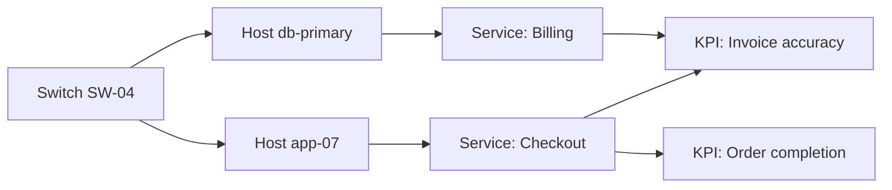
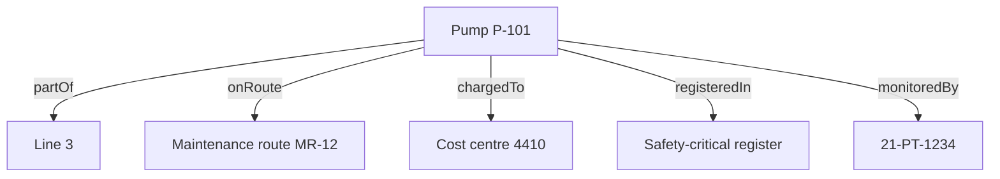

# Knowledge graphs

<Personas>
  <Persona primary>Engineers</Persona>
  <Persona primary>Operations</Persona>
  <Persona>Leadership</Persona>
</Personas>

<KeyIdea>
A knowledge graph stores your operation as things connected by named
relationships, rather than as rows in tables that have to be joined back together.

The practical difference: you can ask questions that follow a chain of connections of
unknown length. *"What else does this switch affect?"* is one question, not a different
query for every possible depth.
</KeyIdea>

## Rows versus connections

A conventional database stores facts in tables and reassembles them with joins. That works
beautifully when you know in advance which tables a question will touch.

Operational questions are not like that. They are usually of the form *"start here and
follow whatever connects, until you find what matters"*, and the number of hops is not
known when the question is asked.

*"What is the blast radius of taking down SW-04?"*, in a graph, you walk outward from
SW-04 and collect what you reach. Two hops, four hops, however far the chain runs; the
question is the same shape either way. In tables, each additional hop is another join, and
the query has to be rewritten every time the answer might be deeper than you guessed.

<Figure
  src="/img/figures/traversal.svg"
  alt="An animation showing a query expanding outward from Switch SW-04: first to the hosts it serves, then to the services running on those hosts, then to the business measure that depends on them."
  caption="A traversal expanding hop by hop. Nobody had to anticipate this question, the relationships were recorded because they are true, and the answer is whatever the walk reaches."
  wide
/>

This is why DataHub keeps the ontology in a graph specifically: the questions users ask of
it are [traversals](https://en.wikipedia.org/wiki/Graph_traversal), and traversals are what
a graph is for.

<Figure
  src="/img/figures/knowledge-graph-oilgas.svg"
  alt="A knowledge graph of an oil and gas processing facility: wells produce to a subsea manifold that flows to the facility, which hosts a separator train, compressor, gas turbine and pumps; a metering skid measures export through the export riser. Above them sit a maintenance program, production revenue, a gas export contract, emissions compliance and the safety case."
  caption="One operation as a graph. Read any arrow as a sentence, 'Wells W-12/W-14 produce to Subsea manifold', 'Metering skid measures Export riser', 'Export riser settles Gas export contract'. Every one of those is a fact somebody already knows; writing them down is what lets software follow them."
  wide
/>

## The questions it makes cheap

These are the kinds of questions a knowledge graph turns from a project into a query. Each
one is a walk across relationships:

| Question | The walk |
| --- | --- |
| *Which assets under this process saw abnormal readings during yesterday's shift?* | Process → the assets serving it → their time series → filter by time and threshold |
| *This KPI moved. What contributed?* | KPI → the functions feeding it → the assets performing them → their signals and events |
| *We are taking this transformer out. What loses supply?* | Transformer → everything it powers → everything those power, recursively |
| *This reading looks wrong. Where did it come from?* | Value → its [lineage](/concepts/lineage-and-quality) → transformations → raw measurements (this walk is planned, arriving with lineage) |
| *A permit was opened on this vessel. What is affected downstream?* | Vessel → downstream connections → their current signals |

None of these require anyone to have anticipated the question. **The relationships were
recorded because they are true, not because a report needed them**, which is exactly why
the model keeps paying off for questions nobody thought of when it was built.

## What it looks like in the console

The **Resources** view draws your graph directly. Nodes are resources, coloured by their
[label](/concepts/taxonomy); lines are relationships.

- **Click a node** to make it the centre and see what it connects to.
- **Expand its relations** to pull the neighbours into view, which is how you follow a
  dependency chain visually: one hop at a time, outward from wherever you started.
- **Filter by relationship type**, so the edges carrying flow stay lit while the containment
  hierarchy dims, and one route through a dense graph becomes readable.
- **Animate a relationship** to watch a data type travel from source node to target node,
  making a flow legible at a glance.
- **Stabilise the layout** when a dense area gets tangled.

Tracing a whole route in one action, where everything off the path dims at once, is on the
roadmap; today the same question is answered by expanding and filtering.

[Working with the resource graph →](/using/resources)

The visual view is genuinely useful for exploration and for explaining the model to
somebody, but the value is not the picture. It is that the same relationships are available
to every query, report, alarm and model behind the scenes.

## Why a graph and not just a hierarchy

Many asset-information systems offer a hierarchy: site contains area contains unit contains
equipment. That is useful and it is not enough, because real operations
are not trees.

A pump belongs to a process line *and* to a maintenance route *and* to a cost centre *and*
to a safety-critical equipment register. In a tree, you must choose one and duplicate the
rest. In a graph, the pump is one node with four different relationships, each named for
what it means.

That difference decides whether the model can serve more than one department.
A tree serves whoever won the argument about what the tree should be
organised by. A graph serves everyone, because each perspective is just a different
set of edges.

## What makes a graph good or bad

A knowledge graph is only as useful as the relationships in it. Three failure modes to
watch for:

- **Vague relationship names.** A model full of *related to* relationships is **a picture, not a
  model**, you cannot traverse it meaningfully because the edges do not mean anything
  specific. Name relationships for what they actually assert.
- **Direction ignored.** *Monitors* and *is monitored by* are different facts. Pick a
  direction convention and hold to it, or traversals will return nonsense in one direction.
- **Orphans.** A resource with no relationships is invisible to every traversal. In
  DataHub refuses a delete that would leave a [resource](/using/resources) with no path to
  the rest of the graph, which is a deliberate nudge: things in the model should be connected
  to something.

[Naming relationships properly →](/concepts/naming-and-standards#relationships)

## How it connects to everything else

The graph is not a separate feature; it is the spine.

- **Time series** hang off the resources they measure, so a signal always knows what it is
  measuring. [Time series →](/using/timeseries)
- **Events** are anchored to the resources they concern, so an alarm points at equipment
  rather than at a tag string. [Events →](/using/events)
- **Files**, P&IDs, datasheets, inspection reports, attach to resources, so documentation
  is reachable from the thing it documents. [Files →](/using/files)
- **Subscriptions** push new values off those same resources the moment they land, so a
  graph-shaped filter is also a delivery filter. [Subscriptions →](/using/subscriptions)
- **Lineage**, when it ships, is itself a graph: every derived value points back at what it
  was computed from. [Lineage and data quality →](/concepts/lineage-and-quality)

Add the live feeds and the graph stops being a map and becomes a
[digital twin](/concepts/digital-twin).

## Where agents help

Two jobs, in opposite directions. Agents **use** the graph, which is most of what
[building AI agents](/using/ai-agents) is about: resolve a node, step outward, read the series
and events hanging off everything reached.

Agents also **grow** it. A relationship that exists in the plant but not in the model often
shows up first in the data, as two signals that move together with no path between their
assets. An agent can surface those candidates for a person to confirm, which is how the graph
keeps up with a plant that changes.
[Relationship analysis →](/using/relationship-analysis)

<References>

- [Knowledge graph](https://en.wikipedia.org/wiki/Knowledge_graph)
- [Graph database](https://en.wikipedia.org/wiki/Graph_database)
- [Property graph model](https://en.wikipedia.org/wiki/Property_graph)
- [Graph traversal](https://en.wikipedia.org/wiki/Graph_traversal)

</References>

<Deeper>
- [Building AI agents](/using/ai-agents): the walk an agent makes across this structure, in seven industries
- [Taxonomy, ontology, knowledge graph](/concepts/taxonomy): how the three layers relate
- [The three layers of a model](/concepts/three-layers): assets, functions, business knowledge
- [Using the resource graph](/using/resources): the console view, in detail
- [Relationship analysis](/using/relationship-analysis): finding connections in the data that are not yet in the model
- [AI agents](/value/ai-agents): why agents reason faster and more accurately against a graph
- [Digital twins](/concepts/digital-twin): what the graph becomes once live data keeps it in step
</Deeper>
