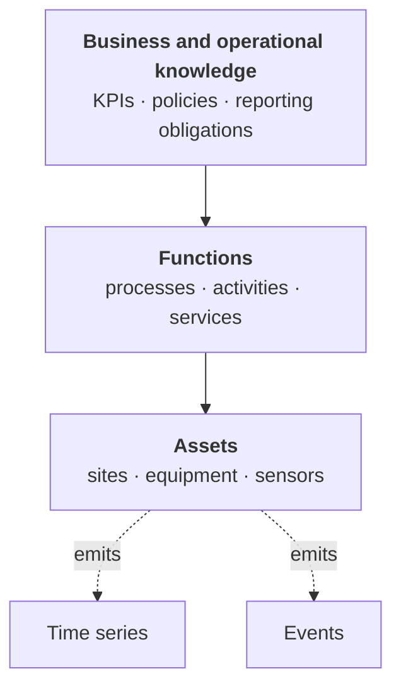
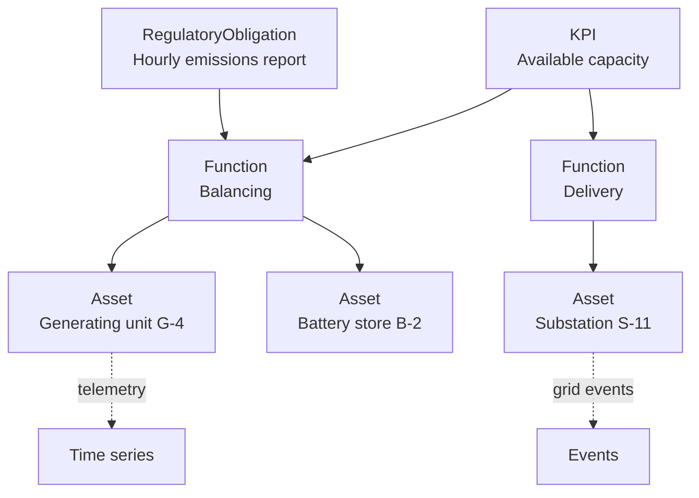

# The three layers of a model

<Personas>
  <Persona primary>Domain experts</Persona>
  <Persona primary>Leadership</Persona>
  <Persona>Engineers</Persona>
</Personas>

<KeyIdea>
A DataHub model describes three kinds of thing:

1. **Assets**, the physical and logical things your operation is made of.
2. **Functions**, what those things *do*: processes, activities, computations.
3. **Business and operational knowledge**, the organisational context: KPIs, policies,
   reporting obligations, commercial boundaries.

Most organisations model the first layer and stop. The third layer is where
the value is, because it is what connects a sensor reading to a decision somebody
cares about.
</KeyIdea>

## Layer 1 · Assets, what exists

The physical and logical things that make up your operation: equipment, sites, sub-systems,
lines, zones, vehicles, meters, instruments.

This is the layer everyone models first, and the one your existing systems already know
something about. It is usually seeded from a maintenance system's equipment register, a
historian's tag list, or an engineering handover package.

**Typical classes:** `Site`, `Area`, `Line`, `Pump`, `Vessel`, `Valve`, `Motor`,
`Transformer`, `PressureTransmitter`, `Server`, `Switch`

**Typical relationships:** `partOf`, `contains`, `feeds`, `powers`, `monitors`, `connectedTo`

:::tip This layer is mostly imported, not typed
If a source system already holds a decent equipment register, import it rather than
recreating it by hand. The modelling effort belongs in layers 2 and 3, which no system
holds.
:::

## Layer 2 · Functions, what things do

What the assets *perform*: the processes, activities, services and responsibilities they
fulfil. A pump is an asset; **pumping the feed to the separator** is a function. A server
is an asset; **hosting the checkout service** is a function.

**Functions matter because they are stable when assets are not.** Equipment gets replaced,
upgraded and re-tagged. The function it performs usually outlives it, which means history
attached to a function stays comparable across equipment changes, and questions asked at
the function level survive the plant being modified.

Functions in DataHub also cover **computations**: derived signals, aggregates and models
that produce new data from existing data. A function of this kind is a resource like any
other, so the values it produces will carry their [lineage](/concepts/lineage-and-quality)
back through it automatically once execution ships. Executable functions, data cleaning, transformation, feature
extraction, streaming computation with windowing, are one of the
[roadmap building blocks](/start/core-ideas#functions-the-computations).

A function of the computational kind has a characteristic shape in the graph: it **reads**
several series and events, and **writes** new ones, cleaned signals, extracted features,
windowed aggregates, detected events. The [functions page](/using/functions) draws all four,
and the wiring itself can be modelled today.

**Typical classes:** `Process`, `Separation`, `Cooling`, `Service`, `Calculation`,
`Aggregation`

**Typical relationships:** `performedBy`, `serves`, `feeds`, `derivedFrom`, `produces`

## Layer 3 · Business and operational knowledge, what matters

The organisational context that turns operational data into decisions: reporting
hierarchies, KPIs, regulatory categories, commercial boundaries, maintenance policies,
safety rules, contractual obligations.

This is the layer that gets skipped, and skipping it is why so many data platforms end up
serving only engineers. Without it, the platform can tell you that a pressure is high. With
it, the platform can tell you that a pressure is high on equipment supporting the process
that feeds the [KPI](https://en.wikipedia.org/wiki/Performance_indicator) you
[report to the board monthly](/value/board-briefing), and that the site is subject to an
emissions obligation that this excursion may affect.

**Typical classes:** `KPI`, `Target`, `Policy`, `RegulatoryObligation`, `Risk`,
`Mitigation`, `Procedure`, `BusinessUnit`,
`Contract`, `MaintenanceStrategy`

**Typical relationships:** `contributesTo`, `governedBy`, `reportedUnder`, `ownedBy`,
`accountableFor`

This layer is also where two whole disciplines attach. **Ownership and accountability**
live here as relationships, which is what makes
[data governance](/concepts/data-governance) a traversal rather than a register. And
**risk thinking** lives here too: a `Risk` connected to the equipment it concerns, a
`Mitigation` connected to the risk it controls,
[bow-tie thinking](https://en.wikipedia.org/wiki/Bow-tie_diagram) as data, so a failed
barrier lights up everything it was holding.
[What can be a resource →](/using/resources#what-can-be-a-resource)

Recorded rules, retention, access, requirements, attach to data here as
[policies](/using/policies).

Model this layer even if it is small. Five KPIs and three
reporting obligations, correctly connected downward to functions and assets, change what
the platform is for, from an engineering tool to something leadership uses.

## Why the layering pays

Because questions enter at different levels and have to travel between them.

| Somebody asks | Enters at | Travels |
| --- | --- | --- |
| *"Why is this reading odd?"* | Asset | Down to signals, sideways to events |
| *"Is this process performing?"* | Function | Down to the assets performing it |
| *"Why did the [KPI](https://en.wikipedia.org/wiki/Performance_indicator) move?"* | Business | Down through functions to assets to signals |
| *"What does this outage put at risk?"* | Asset | **Up** to the functions and obligations affected |

That last one is the direction most organisations cannot answer today,
and it is the one that matters most during an incident. Answering it requires the top layer to exist and to
be connected downward, which is a modelling decision, not a technology one.

## A worked example

A grid operator's model, thinned down to a few nodes per layer:

With this in place, two very different questions are both single traversals:

- *"Which assets contributed to yesterday's capacity shortfall, and what was raised against
  them?"*, start at the KPI, walk down, overlay events.
- *"The hourly emissions figure we submit, which units does it come from, and what was the
  data quality?"*, start at the obligation, walk down to generating units, read the
  lineage on the reported value.

The same model serves an engineer and a regulator, because both layers are present.

## Where to start if the model is empty

Do not start at layer 1 and work up. Start at layer 3 and work down, with exactly one
item.

<Steps>
  <Step title="Pick one thing leadership already cares about">
    One KPI, one report, one obligation. Write it down as a resource.
  </Step>
  <Step title="Ask what functions contribute to it">
    Usually two to five. Add them, connected upward.
  </Step>
  <Step title="Ask what assets perform those functions">
    Now you have a reason to model these particular assets, and a natural boundary that
    stops the exercise from becoming "model the whole plant".
  </Step>
  <Step title="Attach the signals and events those assets emit">
    You now have a vertical slice that answers a real question end to end.
  </Step>
</Steps>

This is the same advice as [Where to start](/value/where-to-start), viewed from the
modelling side: one question, modelled all the way down, beats
a broad model that answers nothing yet.

<References>

- [Asset management](https://en.wikipedia.org/wiki/Asset_management)
- [ISO 55000, asset management standards](https://en.wikipedia.org/wiki/ISO_55000)
- [Performance indicators (KPIs)](https://en.wikipedia.org/wiki/Performance_indicator)
- [Functional decomposition](https://en.wikipedia.org/wiki/Functional_decomposition)

</References>

<Deeper>
- [Building your model](/concepts/building-your-model): how to run the sessions that produce this
- [Digital twins](/concepts/digital-twin): the three layers, kept in step with live data
- [What is an ontology?](/concepts/ontology): the underlying idea
- [Naming and standards](/concepts/naming-and-standards): conventions for classes and relationships
- [Functions](/using/functions): layer 2's computational kind, drawn capability by capability
- [Data governance](/concepts/data-governance): what layer 3's ownership relationships enable
- [Industry examples](/value/industry-examples): the three layers in five different industries
</Deeper>
