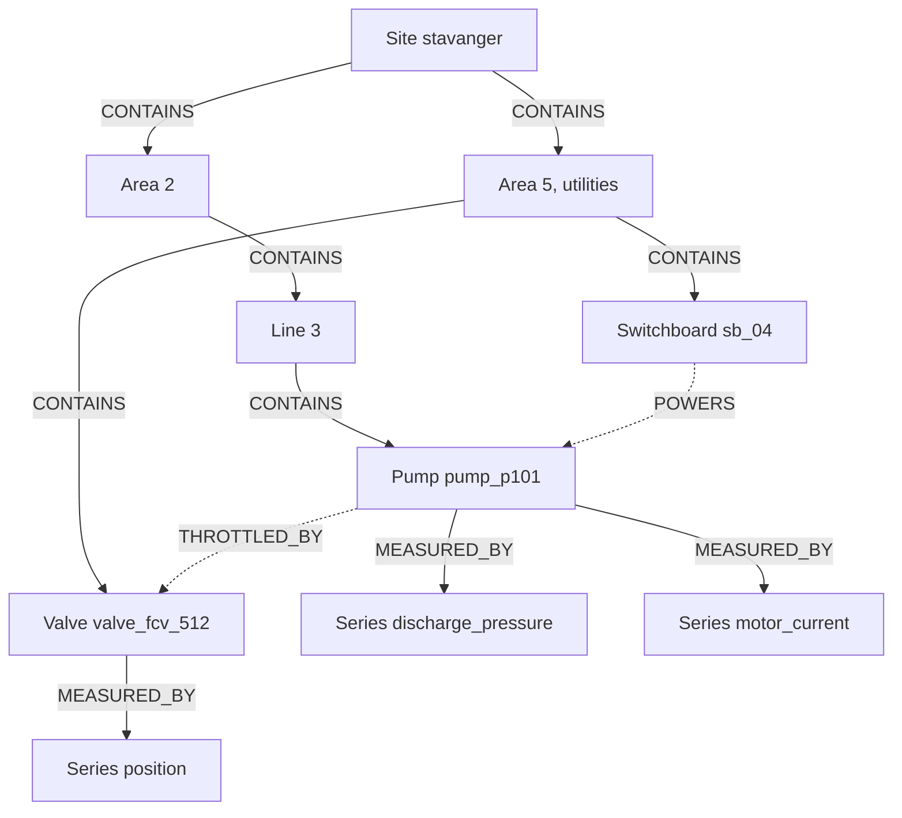

# Unified namespace and the knowledge graph

<Personas>
  <Persona primary>Engineers</Persona>
  <Persona primary>Integrators</Persona>
  <Persona>Operations</Persona>
</Personas>

<KeyIdea>
A unified namespace is <span className="hl">one address space in which every system publishes
its current state under one hierarchy</span>. It answers *"what is it now?"* for everything,
in one place, and that is a real achievement.

What a tree cannot say is how a thing in one branch relates to a thing in another, what
happened before now, or what the documents say about it. DataHub does not replace the tree.
Its *contains* becomes <span className="t-brand">one relationship among many</span>, and the
verbs that cross branches, *feeds*, *throttled by*, *measured by*, are what turn the
namespace into a model.
</KeyIdea>

## What a unified namespace is

<Lead>A unified namespace, usually shortened to UNS, is a publish-subscribe address space
with one agreed hierarchy, most often carried as a topic tree on an MQTT broker.</Lead>

Every producer, a PLC, a gateway, a maintenance system, a lab instrument, publishes its
values under a path that says where in the operation they belong. The path follows the
plant's structure, commonly the enterprise, site, area, line, cell levels of the ISA-95
hierarchy, and ends in the name of the value:

```text
acme/stavanger/area2/line3/pump_p101/discharge_pressure
acme/stavanger/area2/line3/pump_p101/motor_current
acme/stavanger/area5/utilities/valve_fcv_512/position
```

Consumers subscribe to whatever part of the tree they care about. A control-room display
subscribes to `acme/stavanger/area2/#` and sees everything in that area as it changes; a
gateway publishes a new reading only when the value moves, so the broker carries change
rather than repetition. With retained messages, a new subscriber receives the last value of
each topic at once, which is what makes the namespace a picture of the operation's
**current state**.

Three properties follow from the design, and they are worth stating plainly because the rest
of this page rests on them:

- **It is a tree.** Every topic has exactly one parent. A value lives in one place, and the
  path is its whole context.
- **It holds now.** A topic holds one value at a time. When a new one arrives the old one is
  gone, and the broker is not a database. History lives elsewhere, if it lives anywhere.
- **It carries values, not meaning.** A payload is bytes. The unit, the value type and what
  the value is a measurement *of* are conventions the publisher and the subscriber have to
  share out of band.

None of that is a criticism. A namespace that every system publishes into is exactly the
naming discipline this documentation keeps asking for, and if your operation has one, the
model below is much easier to build.

## What a tree cannot express

The hierarchy answers *where is it* and *what is it doing right now*. The questions that fill
an investigation are shaped differently.

| The question | Why the tree cannot answer it |
| --- | --- |
| *What feeds this pump, and what does it feed?* | Flow crosses branches. The valve that throttles line 3 sits under utilities, a different subtree, and no path joins them |
| *What did it do last night?* | A topic holds one value. Yesterday's values were overwritten as they were replaced |
| *What was open on the upstream equipment at the time?* | A work permit is a record with a lifecycle, not a value. If it is published at all, it is published as a state, and the state is gone once it changes |
| *Where is the datasheet, the P&ID, the last inspection report?* | Documents are not values, and the tree has nowhere to hang one |
| *Which of these readings are in bar and which in psi?* | The unit is a convention beside the topic, not a fact the tree records |
| *Who may read this?* | A broker controls access per topic pattern, which is per path, not per the business boundary the data belongs to |

The pattern behind all six: <span className="t-accent">a tree can hold one relationship
type</span>, containment, and real operations are joined by many. The pump belongs to a
line, is throttled by a valve in another branch, is powered from a switchboard in a third,
is measured by instruments, is governed by a permit, and is documented in a folder. In a
tree you choose one of those to organise by and the rest become naming conventions.
[Why a graph and not just a hierarchy →](/concepts/knowledge-graph#why-a-graph-and-not-just-a-hierarchy)

## How the graph relates to the tree

The resource graph keeps the tree. Each level of the path becomes a [resource](/using/resources)
with a [label](/concepts/taxonomy) for its kind, and each parent-child step becomes a
`CONTAINS` relationship. The leaf that carried a value becomes a [time series](/using/timeseries),
attached to the equipment it measures. So far this is the namespace, drawn as a graph.

Then the other verbs are added, and they go wherever the truth goes:



The solid edges are the namespace. The dashed ones are what the namespace could not say. From
the pump, *"what throttles this?"* is now one hop, in a direction the tree does not have, and
*"what loses supply if the switchboard trips?"* is a walk that crosses two branches without
anyone having planned for the question.

Two conventions keep this traversable, both from
[naming and standards](/concepts/naming-and-standards#relationships): name the relationship
for what it asserts, and fix its direction once. `THROTTLED_BY` from the pump to the valve is
a different fact from `THROTTLES` from the valve to the pump, and a model that mixes the two
returns half its answers.

## A mapping recipe

Everything below uses operations that exist today. There is one thing to know first, because
it decides the shape of the work: **the platform does not subscribe to a broker.** There is no
MQTT connector in DataHub, nothing in it opens a connection to your namespace, and the
integration that does is a bridge you run, today typically an Apache NiFi flow or one of
IntelliStream's own Java collectors, subscribing to the topics you choose and pushing through
the same [API and SDKs](/using/timeseries#getting-data-in) every other source uses. The SDKs carry the batching, retries and durable buffering that bridge needs, so it is
usually a short program.

<Steps>
  <Step title="Choose which topics become series">
    Not every topic. A namespace that publishes ten thousand values is not an instruction to
    keep ten thousand histories. Pick the values a question will need, at the rate a question
    will need them, and leave the rest on the broker where they already serve the display.
    [How often should you sample? →](/using/timeseries#how-often-should-you-sample)
  </Step>
  <Step title="Turn the path into resources">
    Each level of the path is a resource, labelled for its kind: `Site`, `Area`, `Line`,
    `Pump`. The external id is the permanent handle integrations match on, and it may not
    contain a forward slash, so the topic path cannot be the id as it stands. Where the plant
    has a tag for the thing, `21-P-101`, use the tag. Where it does not, join the path with
    underscores or use the leaf segment, and keep the full topic in the resource's metadata
    under a key such as `uns_topic`, so the mapping is recorded on the thing it maps.
    Set `source` to the name of the namespace, so a reader can tell where the record came from.
    [What an external id may contain →](/concepts/naming-and-standards#what-an-external-id-may-contain)
  </Step>
  <Step title="Create the tree in one call">
    Nodes and the `CONTAINS` edges between them go in together, and the platform returns the
    persisted graph. In the Python SDK that is `client.resources.create(nodes, edges)`, in Java
    `client.resources().create(nodes, relations)`, in Rust `api.resources.create(...)`, all
    over `POST /resources/create`. Relationship type names are upper-cased on the way in and a
    type you have not used before is created for you.
    <a href="/sdk-documentation/guides/model-assets-graph">Model assets as a graph, in the developer documentation →</a>
  </Step>
  <Step title="Create each series, connected">
    A series needs a unit, a value type and a data set, and it should be created with the
    relationship to the equipment it measures, the way the console's form does it with
    `MEASURED_BY`. The value type is fixed at creation, so decide it from the payload: a
    pressure is `float32`, a totaliser is `bigint`, a mode string is `text`, and a sensor
    that publishes `FAULT` beside its numbers is `mixed`.
    [Value types →](/using/timeseries#value-types)
  </Step>
  <Step title="A published value becomes a datapoint">
    The bridge subscribes to the topic, reads the timestamp *from the payload* rather than
    from the moment of arrival, and sends the value to the series. The bulk path is
    `client.timeseries().ingest(...)` in Java, `client.timeseries.insert_from_lists(...)`
    in Python and `api.time_series.insert_datapoints(...)` in Rust, each batching for you.
    A single value, for a test or from an assistant, is the MCP tool `timeseries_send_datapoint`.
    <a href="/sdk-documentation/guides/ingest-timeseries">High-throughput ingestion →</a>
  </Step>
  <Step title="Add the verbs the tree could not hold">
    `THROTTLED_BY`, `FEEDS`, `POWERS`, between resources that already exist. The SDKs do this
    with `client.edges().create(...)` in Java and `client.edges.create([...])` in Python, over
    `POST /edges/create`; an assistant does it with `edge_create`. This is the step that turns
    the namespace into a model, and it is the one most projects stop before.
    [Contextualization →](/concepts/contextualization)
  </Step>
</Steps>

The mapping, in one table:

| In the namespace | In DataHub |
| --- | --- |
| A level of the path, `area2`, `line3`, `pump_p101` | A resource, labelled for its kind, with the topic kept in metadata |
| Parent to child | A `CONTAINS` relationship |
| A leaf topic that carries a value | A time series, with a unit and a value type, `MEASURED_BY` its equipment |
| A value published on that topic | A datapoint, timestamped from the payload |
| A state published on a topic, `permit_open`, `mode` | An [event](/using/events) when it changes, anchored to the resource, or a `text` series if the sequence of states is the point |
| Nothing | The relationships that cross branches, the history, the documents, the permissions |

## What to keep where

The two are not in competition on delivery. DataHub pushes as well as stores, through
[durable subscriptions](/using/subscriptions#the-two-kinds) that hold a consumer's position
and resume after a disconnect, so a consumer that needs history and context can subscribe
here rather than to the broker. The division that works is by what each one is *for*:

| Keep on the namespace | Keep in the graph |
| --- | --- |
| Current state, fanned out to displays, control-room screens and edge consumers | Identity: one external id per thing, whatever the topic path does |
| The low-latency loops between machines that must not depend on anything upstream | The relationships that cross branches, and the walks that follow them |
| The last value of every topic, retained for a subscriber that just connected | History, at the rate you chose, compressed in the columnar store |
| The naming hierarchy itself, which is the convention the model is built from | Events from every other system, anchored to the same resources |
| | Documents, attached to the things they describe |
| | Who may read what, granted per [data set](/administration/dataset-permissions) rather than per topic pattern |
| | The [tool surface an assistant reaches](/using/mcp), with the same permissions on every call |

If the namespace is the plant's shared vocabulary, the graph is its shared memory. The first
is where a value is published; the second is where a question is answered.

## A worked question across two branches

At 02:10, discharge pressure on `pump_p101` drops. In the namespace, the pump is under
`area2/line3`. The valve that throttles it, `valve_fcv_512`, is under `area5/utilities`, and
nothing in the tree joins them. An assistant with the model in front of it makes the walk the
tree could not:

<Steps>
  <Step title="Resolve the thing">
    `resource_get` with the external id `pump_p101` returns the pump, its labels and its data
    set.
  </Step>
  <Step title="Step outward">
    `resource_fetch_related` from the pump at the default depth of two returns the
    neighbourhood: the line and area above it, the series measuring it, and the
    `THROTTLED_BY` edge to `valve_fcv_512` in the other branch. That edge is the whole point.
  </Step>
  <Step title="Find what measures the valve">
    `resource_fetch_nearest` from the valve with `endLabels` of `TIMESERIES` returns its
    position series, however many hops away it sits.
  </Step>
  <Step title="Read both histories">
    `timeseries_fetch_datapoints` for the pressure and for the valve position between 01:30
    and 02:30. The position starts closing at 01:58, twelve minutes before the pressure moves.
  </Step>
  <Step title="Ask what happened to the valve">
    `event_filter` with `relatedResourceExternalIds` of `valve_fcv_512` over the same window
    returns a work order on the valve, opened at 01:55.
  </Step>
  <Step title="Check the relationship is real, not coincidental">
    `analysis_related_series` with the pressure as focus, over the last week, ranks the valve
    position among the related series with the position leading, which is what the model
    predicted and the data confirms.
    [Relationship analysis →](/using/relationship-analysis)
  </Step>
</Steps>

The answer names the valve, the work order, the two series and the timestamps it used, all of
them in a branch the pump's own subtree never mentions. In the namespace alone, the same
question is a person who happens to know that line 3 is throttled from utilities, and the
answer leaves with them.

## Where agents help

Two jobs, both at the boundary between the tree and the graph. The first is the mapping
itself: an agent can read a namespace, propose which topics become series and which path
segments become resources, and draft the relationships it can infer from naming conventions,
for a person to review. Review the mapping, not just the code: a wrong external id convention
succeeds quietly and is expensive to unwind.
[Agents that build and run integrations →](/value/ai-agents#agents-that-build-and-run-your-integrations)

The second is drift. A topic that starts publishing with no resource behind it, or a resource
whose topic has gone quiet, is the kind of thing an agent notices tirelessly and a person
notices months later. Raise it as an [event](/using/events) against the resource, and the
next person to open it sees the gap.

<References>

- [MQTT](https://en.wikipedia.org/wiki/MQTT)
- [Publish-subscribe pattern](https://en.wikipedia.org/wiki/Publish%E2%80%93subscribe_pattern)
- [ANSI/ISA-95, the hierarchy most namespaces follow](https://en.wikipedia.org/wiki/ANSI/ISA-95)
- [Eclipse Sparkplug, an open payload and topic convention for MQTT in industry](https://sparkplug.eclipse.org/)
- [Tree structure](https://en.wikipedia.org/wiki/Tree_(data_structure))
- [Knowledge graph](https://en.wikipedia.org/wiki/Knowledge_graph)

</References>

<Deeper>
- [Knowledge graphs](/concepts/knowledge-graph): why following relationships answers what a hierarchy cannot
- [Historian and DataHub](/concepts/historian-and-datahub): the other archive that stays, and how the two sit together
- [Naming and standards](/concepts/naming-and-standards): the external id rules the mapping has to respect
- [Contextualization](/concepts/contextualization): attaching each value to the thing it describes
- [Data subscriptions](/using/subscriptions): push delivery from the platform side
- [Using MCP](/using/mcp#the-tools-one-by-one): every tool the worked question used, with its parameters
- <a href="/sdk-documentation/guides/model-assets-graph">Model assets as a graph</a>: the SDK calls behind the recipe
</Deeper>
