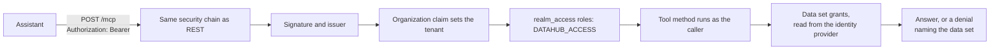

import McpOneProtocol from '@site/src/figures/mcp-one-protocol.svg';
import McpCallPath from '@site/src/figures/mcp-call-path.svg';

# Using MCP

<Personas>
  <Persona primary>Engineers</Persona>
  <Persona primary>Integrators</Persona>
  <Persona>Operations</Persona>
  <Persona>Leadership</Persona>
</Personas>

<KeyIdea>
An AI assistant on its own knows a great deal about the world and
nothing at all about your plant. The Model Context Protocol,
usually shortened to **MCP**, is the standard way to fix that: it lets an assistant call
tools that fetch real data, in a form any assistant can use.

DataHub publishes **38 tools** across two MCP servers. Point an assistant at them and a
question like *"what did the export compressor do overnight, and was anything raised
against it?"* stops being unanswerable. The access rules do not change:
an MCP call is checked exactly like any other request.
</KeyIdea>

## What MCP is

<Lead>MCP is a small open standard that says how an AI assistant asks a system what it
can do, and then does it. Nothing more exotic than that.</Lead>

A system that wants to be usable by AI publishes an **MCP server**: a list of named tools,
each with typed arguments and a description written for the model to read. An assistant, the
**client**, connects, reads the list, and calls the ones it needs. Because the list is
described rather than hard-coded, the assistant works out for itself which tool answers the
question in front of it.

The reason this matters is arithmetic. Before a shared protocol, every combination of
assistant and system needed its own integration, so five assistants and eight systems meant
forty pieces of software that all had to be maintained by somebody. With one protocol, each
system is served once and each assistant speaks it once.

<Figure
  caption="The left panel is the state everyone was in before the protocol existed, and the reason so few AI pilots ever reached real data. The right panel is why an assistant can be useful on day one against a system nobody wrote it for."
  wide
>
  <McpOneProtocol />
</Figure>

The vocabulary, so the rest of this page reads cleanly:

| Term | What it means here |
| --- | --- |
| **Client** | The thing the person talks to: a desktop assistant, a coding tool, the console's own assistant, or an agent you wrote |
| **Server** | The system exposing capabilities. DataHub is one; your maintenance system might be another |
| **Tool** | One named capability, such as `event_filter`, with typed arguments and a description the model reads |
| **Transport** | How they talk. With DataHub it is an ordinary web connection, carrying your normal sign-in token |

## Why it matters now

Three things arrived at roughly the same time, and only the combination is interesting.

**Models became reliable at using tools.** Choosing the right call, filling in its arguments
correctly and reacting sensibly to what comes back used to fail often enough to be a
curiosity. It now works well enough to build on.

**Access to real data stopped being bespoke.** MCP, published as an open standard in late
2024, was adopted quickly and broadly, so the plumbing question, *how do we let this thing
see our data*, has one answer instead of one per vendor.

**Which moves the bottleneck.** When the model is good and the connection is standard, the
thing that decides whether an assistant is useful is
whether the data it reaches has any meaning attached. An
assistant connected to a tag list can fetch numbers it cannot interpret. The same assistant
connected to [a model of your operation](/concepts/knowledge-graph) can follow a signal to
the equipment, the equipment to what it feeds, and the failure to what it will cost.

That is the strategic reading of MCP for an industrial operator: it makes the connection
cheap, and therefore makes the context the scarce part.
[Why that compounds →](/value/ai-agents#why-this-ends-up-being-a-requirement-not-an-option)

:::tip The one-line version for a leadership meeting
MCP is a standard plug. It does not make your data meaningful, it makes meaningful data
reachable, which is why the work on this site, naming, modelling, connecting, is what
decides how much you get from AI.
:::

## What DataHub exposes

DataHub runs two MCP servers, one on the API and one on the analysis service. Each tool is
named after the thing it acts on and what it does to it, so the list reads the same to you
and to the model.

The **API server** publishes 37 tools in seven families:

| Family | Tools | What it lets an assistant do |
| --- | --- | --- |
| **Data sets** | 5 | List, search, create, update and delete [data sets](/using/datasets) |
| **Resources** | 7 | Search and fetch [equipment and other things](/using/resources), create and update them, walk outward to a neighbourhood, or hunt for the nearest thing of a given kind |
| **Relationships** | 5 | List and create [relationship types](/concepts/knowledge-graph), connect two existing things, delete an edge |
| **Time series** | 9 | Find [series](/using/timeseries), read the latest value, fetch history between two timestamps, append a datapoint |
| **Events** | 6 | Search, filter, read, create, update and delete [events](/using/events) |
| **Labels** | 3 | List and manage the [labels](/concepts/taxonomy) that classify things |
| **Units** | 2 | Look up units of measure, so a number arrives with its dimension |

Three are worth knowing by name, because they are what make an answer good rather than
merely fast:

- **`resource_fetch_related`** returns a thing's neighbourhood in one call rather than
  making the assistant crawl edge by edge. This is the tool that turns *"what does this
  affect?"* into a single question.
- **`resource_fetch_nearest`** asks the sharper version: not *"what surrounds this"* but
  *"where is the nearest thing of this kind"*, breadth-first outward until it has found
  enough of them. This is how an assistant gets from a pump to the series measuring it
  without knowing your modelling conventions.
- **`event_filter`** answers anything time-bounded or exact. Search is for when the
  assistant only has words to go on.

### The second server: statistics as a tool {#the-second-server-statistics-as-a-tool}

The analysis service publishes its own `/mcp` with a single tool,
**`analysis_related_series`**. Given one series and a window, it walks the graph outward to
find physically related candidates, tests each pair statistically and returns them ranked:
how strongly they move together, which one leads, whether the link survives removing shared
trends, and whether it holds across the whole window or rides one burst.

This is the same [relationship analysis](/using/relationship-analysis) behind the console's
Analyze tab, and it matters more for an agent than for a person. Asked *"what is driving
this?"*, an assistant with only raw numbers will estimate, and estimate confidently. With
this tool it can answer from the statistics instead.

The full tool list, with arguments and return shapes, is in the
<a href="/sdk-documentation/mcp-server">developer documentation</a>.

## The tools, one by one {#the-tools-one-by-one}

The family table above is how the servers are organised. This is the list by what an
assistant is trying to do, which is how the tools get used. Every tool is named
`<domain>_<action>`, takes flat scalar arguments rather than nested documents, and works on
one thing per call, so an assistant loops where a written integration would send a batch.
Ids can be given as the numeric `id` or the `externalId`, and where a tool accepts both it
insists on exactly one.

### Find things

| Tool | Arguments | Returns |
| --- | --- | --- |
| `resource_search` | `query`, `limit` (default 100, max 1000) | Full-text search across every node type, assets, series, functions, data sets and policies, on name, external id and description, ranked by relevance |
| `timeseries_search` | `query`, `limit` | The same, for series only |
| `dataset_search` | `query`, `limit` | The same, for data sets, whose ids `timeseries_create` needs |
| `event_search` | `query`, `limit` | Substring search over an event's external id, description and metadata values, newest first |
| `resource_get` | `ids` and/or `externalIds`, comma-separated | The full record of one or more resources |
| `timeseries_get` | `externalId` or `id` | The full record of one series: unit, value type, data set, metadata |
| `event_get` | `externalIds` and/or `ids` (UUIDs), as lists | The full record of the named events; misses are simply absent |
| `edge_get` | `id` | One relationship, by its numeric id |
| `timeseries_list`, `dataset_list` | `limit` | Browsing when there is no search term yet |

Searches and lists return a compact envelope: `items`, `returned`, and `truncated` when the
result filled the cap you asked for, which is the signal to narrow rather than page. Each item
is a trimmed projection, so a search over ten thousand series does not flood the model with
audit timestamps: a series arrives as its id, external id, name, data set, unit, description
and metadata, and the `*_get` tools are where the full record lives.

### Walk the graph

| Tool | Arguments | Returns |
| --- | --- | --- |
| `resource_fetch_related` | `externalId` or `id`; `depth` (default 2, `-1` for the whole connected component) | The neighbourhood: nodes, the edges between them, and the labels in play |
| `resource_fetch_nearest` | `externalId` or `id`; `endLabels`; `limit` (default 10); `relationshipTypes`; `excludedLabels` | Breadth-first to the closest nodes carrying one of the end labels, plus the sub-graph connecting them. The cap counts matches, not hops |
| `edge_list_types` | `limit` | The tenant's relationship types, the vocabulary the edges use |
| `label_list` | `limit` | The tenant's labels, the vocabulary the nodes use |

`resource_fetch_related` is bounded to two hops by default because a plant is more connected
than it looks; `resource_fetch_nearest` is the one to reach for when the assistant wants a
specific kind of neighbour, *the series measuring this pump*, because the answer is exact
however many intermediate nodes lie between.

### Read measurements

| Tool | Arguments | Returns |
| --- | --- | --- |
| `timeseries_get_latest` | `externalId` or `id` | The most recent datapoint, answered from a cache rather than a scan, for *"what is it reading now?"* |
| `timeseries_fetch_datapoints` | `externalId` or `id`; `start`, `end` (ISO-8601, end exclusive); `limit` (default 1000, hard max 100000); `aggregates` and `granularity` | Raw samples, or, with `aggregates` of `avg`, `sum`, `min`, `max` and a bucket such as `1h`, one value per bucket |

Timestamps come back as ISO-8601 strings, the same as the REST API, so a value reads the same
whichever way an assistant reached it.

### Read what happened

| Tool | Arguments | Returns |
| --- | --- | --- |
| `event_filter` | `type`, `subType`, `source` (exact, case-sensitive); `externalId` with `*` as a wildcard; `dataSetId` or `dataSetExternalId` (lists); `relatedResources` or `relatedResourceExternalIds` (lists, the event must touch all of them); `start`, `end` on event time; `groupBy`; `limit` (default 25, max 10000) | Two shapes. With `groupBy` set to one of `type`, `subType`, `source`, `dataSetId`, `externalId`, `day`, `hour`: buckets of value and count, most frequent first, and a total, and no events. Without it: up to `limit` compact events, with `returned` and `truncated` |

The two shapes are the difference between an assistant that scans and one that asks. Grouping
by `type` over a window answers *"how many, of what kinds?"* in one call; grouping by
`externalId` surfaces the busiest lifecycles, because events that share an external id are the
history of one logical thing. Drill down after that, on the bucket that mattered.

### Vocabulary an answer needs

| Tool | Arguments | Returns |
| --- | --- | --- |
| `unit_list` | `limit` | The unit catalogue: external id, name, symbol and quantity, so a number arrives with its dimension |
| `unit_get` | `externalId` | One catalogue entry, in full |

### Statistics, on the second server

| Tool | Arguments | Returns |
| --- | --- | --- |
| `analysis_related_series` | `focusExternalId`; `start`, `end`; `limit` (default 10, max 200); `relationshipTypes`; `analyses` from `raw`, `whitened`, `cointegration`, `coherence`, `stability` | Candidates found by walking the graph from the focus, each with its path, correlation and lag in seconds, whether the link survives prewhitening, whether the pair is cointegrated and stable, the strongest shared period, and a rank score. Series that could not be tested are listed as skipped, with a message saying why |

### Create and connect

| Tool | Arguments | Returns |
| --- | --- | --- |
| `dataset_create` | `externalId`, `name`, `description` | The data set, with its server-assigned id |
| `resource_create` | `externalId`, `name`, `labels` (comma-separated, at least one), `description`, `dataSetId` | The resource. Relationships are not set here; a graph-shaped create goes through the API |
| `timeseries_create` | `externalId`, `name`, `dataSetId`, `description`, `valueType`, `unit` or `unitExternalId` | The series. It refuses without a unit, and names the two arguments that would satisfy it |
| `event_create` | `externalId`, `type`, `dataSetId`, `eventTime`, `subType`, `status`, `description`, `relatedResourceExternalIds` | The event. The related resources must already exist |
| `edge_create` | `fromExternalId` or `fromId`; `toExternalId` or `toId`; `relationshipType`; `description` | The edge between two nodes that already exist |
| `edge_create_type`, `label_create` | `name`, `description`, `i18nCode`, and a `color` for labels | The type or label, its name coerced to `SCREAMING_SNAKE_CASE` |

### Change and append

| Tool | Arguments | Returns |
| --- | --- | --- |
| `dataset_update`, `resource_update`, `timeseries_update`, `label_update` | `id`, then only the fields to change, named `newName`, `newDescription`, `newExternalId` and so on | The updated record. Anything not supplied is left alone; metadata add and remove, and edge updates, are API-only |
| `event_update` | `id` (UUID) or `externalId`, then `newType`, `newSubType`, `newStatus`, `newDescription`, `newExternalId` | The updated event |
| `timeseries_send_datapoint` | `externalId` or `id`; `timestamp` (ISO-8601 or epoch milliseconds); `value` as a string | The insert result. One datapoint per call; the bulk path is the API |

### Delete

| Tool | Arguments | Returns |
| --- | --- | --- |
| `dataset_delete` | `id` or `externalId` | `deleted`. Refuses while members remain: nothing cascades |
| `resource_delete` | `id` or `externalId` | `deleted`. Its edges go with it; neighbours are untouched |
| `timeseries_delete` | `id` or `externalId` | `deleted`. The definition only; stored datapoints are swept separately |
| `event_delete` | `externalIds` and/or `ids`, as lists | How many references were submitted |
| `edge_delete` | `id` | `deleted`. The relationship only, never the nodes |

### What the server trims before the model sees it

Every tool serialises through one converter, and it does three things a REST client would
never notice. Nothing empty is sent: nulls, empty collections and empty strings are dropped,
so an analysis that did not run leaves no field behind and a resource without metadata has no
`metadata` key. Dates render as ISO-8601 strings. A tool with nothing to return says `Done`.
The list and search tools go further with the projections above, and the analysis result
drops its full spectra and raw test statistics in favour of the verdicts, so a wide answer
stays inside a context window.

## The security property that matters

This is the part worth reading even if somebody else will do the connecting.

<Figure
  caption="Nothing in this path was added for agents. The gate is the same one the console and every REST client pass through, in the same order, and it is the same on both servers, which is why an agent's reach is decided entirely by whose token it holds."
  wide
>
  <McpCallPath />
</Figure>

- **There is no separate door and no agent key.** Every request from an assistant carries
  the same sign-in token as everything else and passes the same checks, on both servers.
- **An agent inherits the permissions of whoever it acts for.** If it should read but not
  write, issue it a token that can read but not write. There
  is no second permission model to keep aligned with the first.
- **Which tenant an assistant sees is fixed by the organisation recorded in its token**, so
  it cannot reach another tenant's data even by asking for an id it happens to know.
  [Organizations →](/administration/organizations)
- **Scoping an assistant is scoping a service account.** Create one in your identity
  provider, grant its groups read on the data sets it should see, and it can see nothing
  else. [Service accounts →](/administration/users-and-access#service-accounts)

:::caution The approval step is yours to build
A server executes what it is asked. It cannot stop mid-call to ask a person to confirm a
write or a delete, so **if an assistant should pause for a human before it changes anything,
that gate belongs in the agent you build**, not in the platform. The simplest version is
also the strongest: an assistant with no business writing gets a token that cannot write.
[Guardrails in practice →](/using/ai-agents#the-four-limits-worth-setting)
:::

## How identity travels

<Lead>There is one token, it is the caller's, and it is checked at three gates before a tool
runs and once more inside it. Nothing along the path is specific to agents.</Lead>

**From the assistant to the server.** An MCP request is `POST /mcp` with the caller's OAuth2
token in the `Authorization` header, on every call, because the servers run in stateless
mode and hold no session. That endpoint is an ordinary route on the API, so it sits behind the
same security chain as every REST call and there is no MCP-specific bypass.

**At the door.** Three checks run before any tool body executes, in this order. The token's
signature and issuer are verified. The `organization` claim must name exactly one
organisation, and its id becomes the tenant for the rest of the request; a token naming none,
or several, is refused. The roles in `realm_access` become authorities, and every non-public
route requires `DATAHUB_ACCESS`, so a valid token without that role authenticates and can
then read and change nothing.

**Inside the tool.** The tool method runs on the request thread as that caller, and calls
the same services the REST controllers call. Those services ask one authoriser whether the
caller may read or write the data set an entity belongs to, and that authoriser reads the
caller's grants, the `/datasets/<externalId>/read` and `/write` groups, from the identity
provider's UserInfo endpoint rather than from the token. The answer is cached briefly, in
process and in the shared cache, which is why a revoked grant stops working within about a
minute rather than at token expiry. If the identity provider cannot be reached for long
enough, the request fails closed: *could not verify* is never turned into *permitted*.
[Data set permissions →](/administration/dataset-permissions)

**On the analysis server.** The same chain, the same role. Its one tool gathers its data by
calling the API with the caller's own token forwarded, so the data set grants apply to a
statistical answer exactly as they apply to the datapoints it was computed from.

**Through the console assistant.** The console's bridge to the servers takes the bearer token
as a parameter on every call and never holds one on the instance, so there is no shared
service account it could quietly become. The token is the signed-in user's own, fetched on the
request thread and refreshed by the console's session; when it expires mid-conversation, the
`401` propagates and the user is asked to sign in again rather than the assistant answering
from stale rights.

### What a denial looks like

The [same rules as everywhere](/administration/dataset-permissions#how-denial-behaves), seen
through a tool:

- **A search or list omits what the caller may not read.** No error, no gap in the
  numbering. `timeseries_search` for a person who can read two data sets returns series from
  two data sets, and the model has no way to tell there were seven.
- **A direct read of something the caller may not see is refused**, with a `403` whose body
  names the `dataSetId` and the `permission` that was missing. `resource_get` on a resource
  in a data set the caller cannot read is refused this way; so is `resource_fetch_related`
  started from it, because a traversal is checked on the node it starts from.
- **A relationship the caller may not see is invisible**, not refused. `edge_get` needs read
  on both ends, and a missing grant on either looks exactly like an edge that does not exist.
- **A write without the grant is refused**, naming the data set and the permission, so the
  fix is obvious: `timeseries_send_datapoint` into a series the caller cannot write fails
  loudly, and nothing lands.

A refusal inside a tool reaches the assistant as a failed tool result carrying that message,
not as an empty answer, so a well-written agent can say *"I was not permitted to read that"*
rather than *"there was nothing there"*. And the request that was refused is recorded by the
same request log, in the same shape, as the request that was answered: the log filter runs
after every call whatever its status, so a denial is evidence rather than silence.

## A worked example: the same question, two identities

The question: *"What happened to the export compressor K-401 overnight, and is anything
upstream of it explaining the vibration?"* The model is the same, the tools are the same, and
the token is different.

**The maintenance lead**, whose groups include `/datasets/plant_a/read`, where `plant_a` is
the root that every production data set sits under, and `/datasets/plant_a/write`.

1. `resource_search` for *K-401* returns the compressor, in `plant_a_rotating`.
2. `resource_fetch_related` from it returns the lube system, the driver, the export line it
   feeds, the separator upstream of it, and the series measuring each.
3. `event_filter` with `relatedResourceExternalIds` of `K-401` and a window from 22:00 to
   06:00 returns a high-vibration alarm at 02:40 and a lube work order opened at 03:10.
4. `timeseries_fetch_datapoints` on the vibration and on the separator's inlet pressure
   show the pressure stepping up at 02:15.
5. `analysis_related_series` with the vibration as focus confirms the inlet pressure among
   the related series, leading.
6. The answer names the alarm, the work order, the two series and the timestamps, and the
   agent, holding write, records its summary as an event against `K-401`.

**A contractor's assistant**, running on a service account whose only group is
`/datasets/plant_a_rotating/read`.

1. `resource_search` for *K-401* returns the compressor: it sits in a data set the account
   can read.
2. `resource_fetch_related` returns the same neighbourhood, because a traversal is gated on
   the node it starts from. The contractor sees that a separator exists upstream.
3. `event_filter` over the same window returns the alarm and the work order, both in
   `plant_a_rotating`.
4. `timeseries_fetch_datapoints` on the vibration succeeds. The same call on the separator's
   inlet pressure is refused: the series belongs to `plant_a_process`, and the response
   names that data set and the missing `read` permission.
5. `analysis_related_series` runs, but lists the process-side series as skipped rather than
   analysing them, because the analysis server reads through the API with this same token.
6. The honest answer: the alarm and the work order, the vibration trace, and *"there is
   upstream equipment I was not permitted to read"*. No summary is written back, because
   the account holds no write grant, and the attempt would have been refused with the data
   set named.

Two things in that second run are worth noticing. The traversal showed the contractor that
the separator exists, which is the [documented boundary](/administration/dataset-permissions#graph-traversal-is-gated-on-the-starting-node-only)
of a data set inside a connected graph; if the separator's existence is itself sensitive,
separate it in the model or in the tenant, not in a data set. And nothing about the second
answer was configured for agents: the contractor's assistant saw exactly what the contractor
would see in the console, for the same reason.

## Mutating tools and confirmation

Eighteen of the thirty-seven API tools change something: the six `*_create` tools, the five
`*_update` tools, the five `*_delete` tools, `edge_create_type` and `timeseries_send_datapoint`.
The analysis server's tool is read-only. What the platform does about that today, precisely:

- **The servers do not pause to ask.** Both run in the protocol's stateless mode, which has no
  channel from the server back to the person for a confirmation. A mutating tool executes
  the moment it is called, and the code says why: the stateful mode that would allow a
  confirmation step needs session affinity on the load balancer and a different security
  and thread model, and that trade was not worth making for an entity surface whose updates
  are rare. If it is ever needed, the path is known: switch the server to stateful mode and
  have each mutating tool ask before it writes. Until then the gate is yours to build.
- **The console assistant refuses them twice.** Its policy is a default-deny allowlist of
  twenty read-only names, nineteen on the API server and the analysis tool. Anything not on
  the list, including a tool added later, is filtered out before the model ever sees the tool
  list, and if the model asks for one anyway the request is refused again at the moment it
  would run, and logged.
- **Deletes do not cascade.** A data set with members refuses to go; a series delete leaves
  its datapoints to a separate sweep; an edge delete never touches a node. An agent tidying
  up needs more than one call, and a half-finished tidy leaves orphans rather than damage.
- **Names are coerced.** Relationship types and labels become `SCREAMING_SNAKE_CASE`
  server-side, so an agent that creates *derived from* and then searches for that string
  will miss `DERIVED_FROM`.
- **Batch shapes stay on the API.** Creating nodes and edges together, atomically, is a
  graph-shaped payload that flat tool arguments cannot carry, so an agent building a model
  creates the nodes one by one and connects them with `edge_create`, or hands the batch to a
  written integration.

The working pattern this leaves is the one the rest of this documentation calls
the agent drafts and a person commits. An assistant that
investigates holds a read-only token and cannot change anything. An agent that should record
what it found holds a write grant on one data set and writes [events](/using/events) there,
which are append-only in normal use and reviewable afterwards. An agent that should change
the model produces the change as a proposal, and the person with authority makes the call,
with their own token. Each of those is a token scope, not a setting, and none of them
depends on the model behaving.
[The four limits worth setting →](/using/ai-agents#the-four-limits-worth-setting)

## Connecting an assistant

<Steps>
  <Step title="Decide whose eyes it looks through">
    A person's own login is right for a desktop assistant they use themselves. A
    [service account](/administration/users-and-access#service-accounts) is right for
    anything that runs unattended, because its access can be scoped and revoked without
    touching a person's account.
  </Step>
  <Step title="Grant it read on the data sets it should see">
    Membership of the read group for each data set, and nothing wider. Grants take effect
    within about a minute. [Data set permissions →](/administration/dataset-permissions)
  </Step>
  <Step title="Point the client at the servers">
    Any MCP-capable assistant that can send your token will work. It needs the two server
    addresses and the token, entered once in its own settings; the exact form depends on the
    client, and the developer documentation shows it. Tokens are short-lived, so anything
    that runs unattended should be set up to renew its token automatically rather than have
    one pasted into a file once.
    <a href="/sdk-documentation/mcp-server">The connection details, in the developer documentation →</a>
  </Step>
  <Step title="Ask something that needs the model">
    Not *"what is the pressure on P-101"*, which any historian could answer. Ask *"what feeds
    P-101, and did anything happen upstream of it last night?"* If the answer names the
    upstream equipment and the event, the connection and the model are both doing their job.
  </Step>
  <Step title="Check what it did, not just what it said">
    A good answer cites the ids, timestamps and values it used. Spot-check two of them in the
    console. Do this on the first few answers and you will calibrate quickly on where the
    model is thin.
  </Step>
</Steps>

## The console assistant: MCP with nothing to set up

The console's own assistant is a client of the API's server, which makes it the easiest way
to see what an AI assistant can do with your data before anybody wires anything up.

It is deliberately stricter than a general client:

- **Read-only, from a fixed list.** It is offered a named set of read-only tools and nothing
  else. Anything not on that list, including a tool added to the platform later, is
  withheld, and a request for one is refused again at the moment it would run, so the
  property holds even if the model asks.
- **It answers about your tenant, not about the world.** Asked *"anything unusual this
  weekend?"*, it reads events and datapoints in your own data rather than answering from
  general knowledge, and it says so plainly when the tools return nothing.
- **It bounds itself.** Up to six model-to-tool round trips per question, oversized tool
  results truncated with a note telling the model to narrow its query, and a capped
  conversation history.
- **It can hand you the console.** Alongside the data tools it offers navigation tools, so
  an answer can arrive with a button that opens the events, resources,
  [insights](/using/insights) or [Analyze](/using/relationship-analysis) view, already
  filtered to what it just looked up.
- **Three switches must agree** before it appears at all: enabled in the deployment, enabled
  for your tenant, and the signed-in user holds the `DATAHUB_CHAT` role.
  [How that is controlled →](/administration/security#ai-agents-and-the-console-assistant)

## What MCP does not do

| It does not | Which means |
| --- | --- |
| **Add context you never modelled** | An assistant reaching an unmodelled tag list gets numbers without meaning, faster. The protocol carries what is there. [Building your model →](/concepts/building-your-model) |
| **Ask permission before it writes** | A server has no way to interrupt a call for a human decision. Put that gate in the agent, or issue a read-only token |
| **Widen what a user can see** | The token decides. An assistant used by a person sees exactly what that person sees, no more |
| **Cache anything** | Every call is authorised afresh, so a revoked grant stops working within about a minute rather than at the next sign-in |
| **Replace the API** | For a fixed integration that runs the same way every day, write it against the [API](/using/building-applications). MCP is for the case where the sequence of calls is decided at the time by a model |

<References>

- [Model Context Protocol](https://modelcontextprotocol.io/): the specification and its documentation
- [Model Context Protocol on Wikipedia](https://en.wikipedia.org/wiki/Model_Context_Protocol)
- [OAuth 2.0](https://en.wikipedia.org/wiki/OAuth)
- [JSON Web Token](https://en.wikipedia.org/wiki/JSON_Web_Token)
- [API](https://en.wikipedia.org/wiki/API)

</References>

<Deeper>
- [Building AI agents](/using/ai-agents): what to build on top of these tools, and the examples that already work
- [AI agents](/value/ai-agents): why a model makes an agent both faster and more accurate
- <a href="/sdk-documentation/mcp-server">MCP servers reference</a>: both endpoints, the full tool list and the result shapes
- [Security](/administration/security#ai-agents-and-the-console-assistant): the review answer on agent access
- [Users and access](/administration/users-and-access#service-accounts): scoping the account an assistant uses
- [Building applications](/using/building-applications): when a written integration is the better tool
</Deeper>
